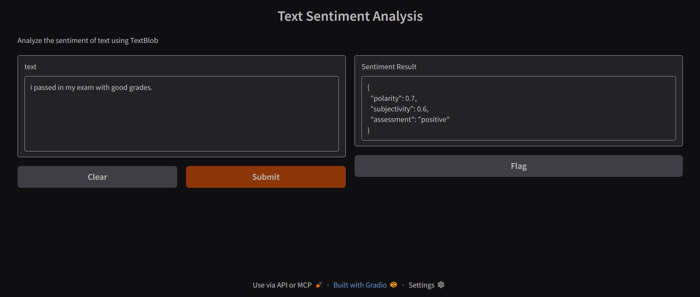
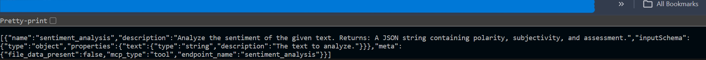
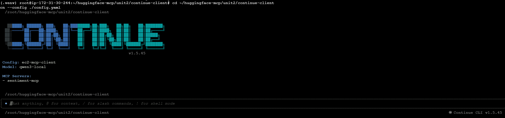
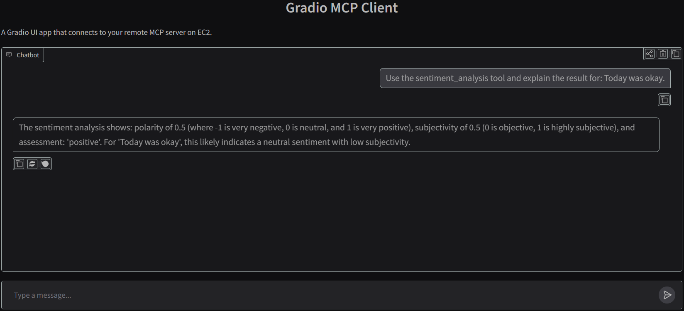
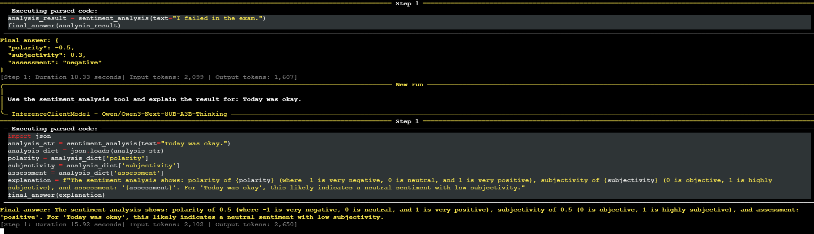
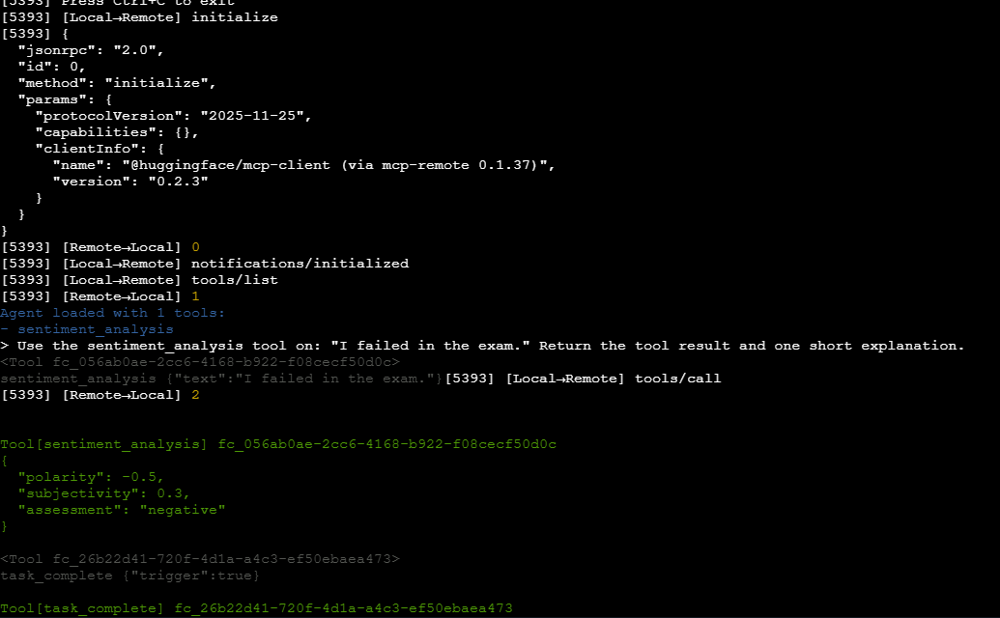

# 🛠️ Unit 2 — End-to-End MCP Application

<div align="center">

<p>
  
  
  
  
</p>

</div>

---

# 🎯 Purpose

This folder documents my **hands-on Unit 2 work** from the Hugging Face MCP Course.

The focus of this unit was to move beyond theory and build an **actual MCP application**:

1. create an MCP server with Gradio
2. connect multiple kinds of MCP clients
3. verify remote connectivity
4. observe real tool calls and end-to-end behavior

Instead of following the unit purely on a local desktop setup, I adapted the practice to a **more realistic two-machine AWS EC2 workflow**.

---

# 🧭 What I Built

## 1) Gradio MCP Server
I built a sentiment analysis application using **Gradio + TextBlob** and enabled MCP support so the same app could be used:
- by a human through the web UI
- by AI clients through MCP

## 2) MCP Client Connectivity
I then configured multiple client flows against that server:
- generic MCP configuration files
- Continue CLI as a coding-assistant style client
- a Gradio UI acting as an MCP client
- Tiny Agents calling the MCP tool through `mcp-remote`

## 3) Remote Practice Architecture
I separated the setup into:
- **server EC2** → hosted the MCP server
- **client EC2** → ran the MCP clients

That made the practice closer to a real deployment pattern than a single local laptop-only setup.

---

# 🧱 Practical Architecture Used

```text
[Server EC2]
  └─ Gradio sentiment analysis app
     ├─ Web UI
     ├─ MCP schema endpoint
     └─ MCP SSE / HTTP endpoint

[Client EC2]
  ├─ MCP config files
  ├─ Continue CLI client
  ├─ Gradio MCP client UI
  └─ Tiny Agents client
```

---

# ✅ Sections Covered

## A. Introduction to Building an MCP Application
Understood the role of Unit 2 in the course:
- build a complete MCP workflow from server to client
- connect multiple client styles to one server
- prepare for more advanced real-world workflows later

## B. Building the Gradio MCP Server
Implemented:
- a simple sentiment analysis tool
- JSON output with polarity, subjectivity, and assessment
- `mcp_server=True` so the Gradio app exposed MCP endpoints
- remote access from EC2

## C. Using MCP Clients with Your Application
Configured:
- `mcp.json`
- `config.json`
- SSE endpoint references
- remote client-to-server connectivity tests

## D. Using MCP in Your AI Coding Assistant
Adapted the Continue lesson for a terminal/EC2 workflow using:
- Ollama
- Continue CLI
- a custom `config.yaml`
- MCP server registration via SSE

## E. Building an MCP Client with Gradio
Created a second Gradio app that behaved as an MCP client:
- connected to the remote MCP server
- used `smolagents`
- exposed a chat UI for the tool-backed workflow

## F. Building Tiny Agents with MCP and the Hugging Face Hub
Connected Tiny Agents to the remote server:
- used `mcp-remote`
- listed the available tool
- successfully invoked `sentiment_analysis`
- observed the final tool output in the terminal flow

## G. Local Tiny Agents with AMD NPU and iGPU Acceleration
I reviewed this page conceptually, but I did **not** reproduce it 1:1 in the public EC2-based setup because:
- the page is designed for a local AMD hardware workflow
- its main value is on-device/local acceleration and local file handling
- my documented practice environment for this unit was cloud-based EC2

That section is therefore represented here as a **documented note**, not a fake implementation claim.

---

# 📸 Practical Evidence

## 1. Gradio MCP Server UI



This shows the sentiment analysis app working through the normal web interface.

---

## 2. MCP Schema Output



This confirms that the server exposed the MCP tool schema for machine-readable discovery.

---

## 3. Continue CLI Connected To MCP



This shows the Continue-based MCP client recognizing the configured MCP server.

---

## 4. Gradio Acting As An MCP Client



This is the separate Gradio UI client connected to the remote MCP server.

---

## 5. smolagents / Tool Call Log



This captures the model using the `sentiment_analysis` tool and returning a result.

---

## 6. Tiny Agents End-to-End Tool Use



This shows Tiny Agents loading the MCP tool and calling it successfully through `mcp-remote`.

---

# 📂 What Is Included In This Folder

## Notes
- `unit2-notes.md` — detailed learning and implementation summary
- `official-resources.md` — the official Unit 2 pages used as the base structure
- `lemonade-server-notes.md` — note explaining how the local/AMD hardware page fits into the portfolio honestly
- `ec2-practice-setup.md` — copy-paste oriented setup summary for the two-instance practice flow

## Code / Configs
- Gradio MCP server implementation
- generic client configuration files
- Continue CLI configuration
- Gradio MCP client implementation
- Tiny Agents configuration and notes

## Screenshots
Renamed screenshots are included to make the documentation readable and portfolio-friendly.

Sensitive IPs/endpoints used during the original EC2 practice have been **removed or replaced** in the public code/config files, and screenshots used here avoid exposing the raw setup details.

---

# 🧠 Key Takeaways

By the end of this unit’s practical work, I had hands-on familiarity with:

- exposing a Python function as an MCP tool through Gradio
- verifying schema and protocol endpoints
- connecting remote clients over MCP
- understanding why MCP configuration matters
- observing actual tool discovery and execution flows
- comparing different MCP client patterns in one practical project

---

# 🔐 Public Repository Safety

Because this folder is intended for GitHub/portfolio use:
- configuration files use placeholders or environment-driven values
- no IP addresses are hardcoded
- no personal tokens, secrets, or API keys are included
- reusable templates are preferred over dumping private lab details

---

# 🔜 Good Next Improvements Later

Possible future upgrades for this folder:
- add a more advanced MCP server beyond sentiment analysis
- add local-vs-remote transport comparison notes
- include a Python-first MCP client beyond the current configs
- document Unit 3/advanced sections when completed
