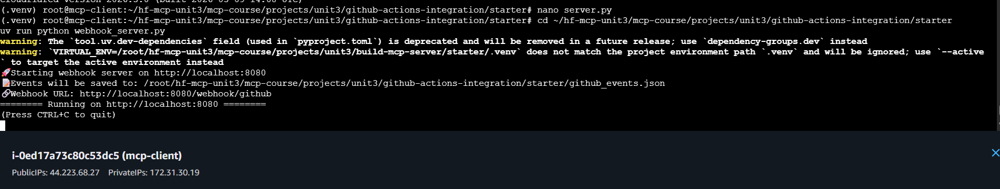
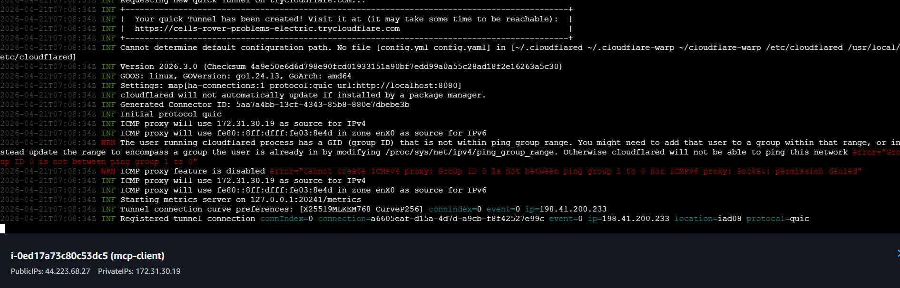
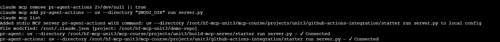
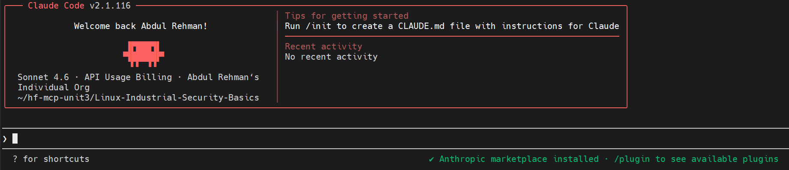
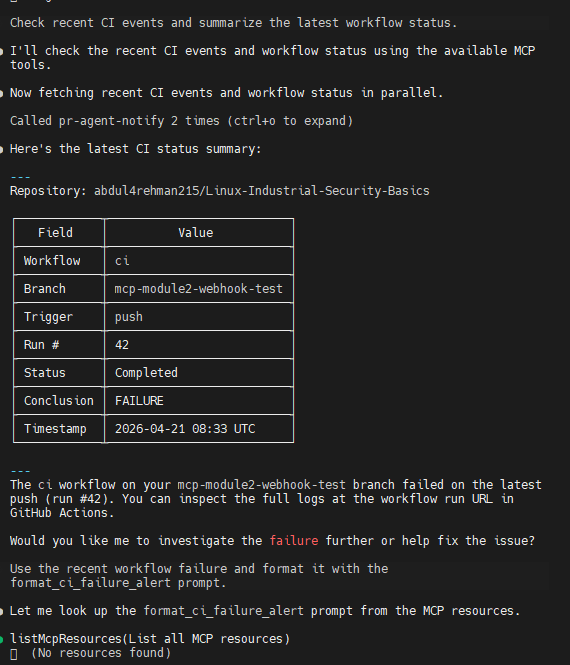
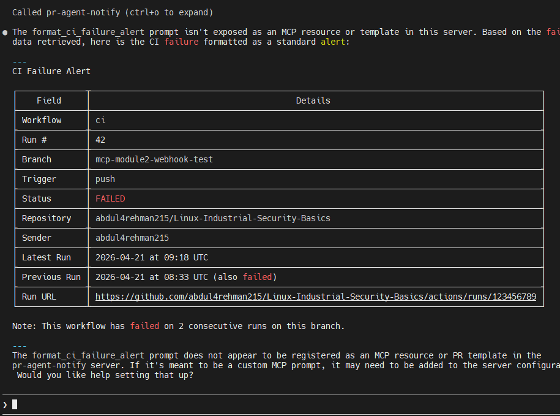
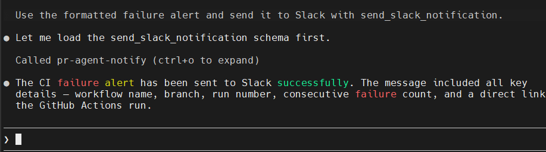
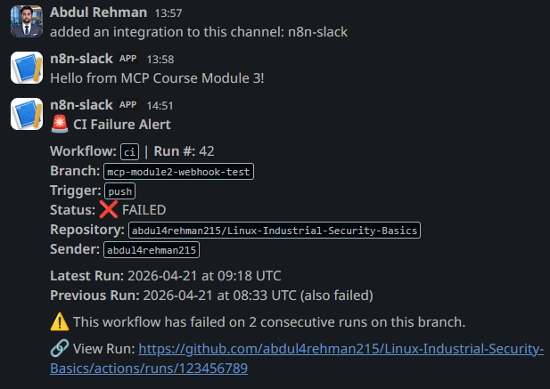
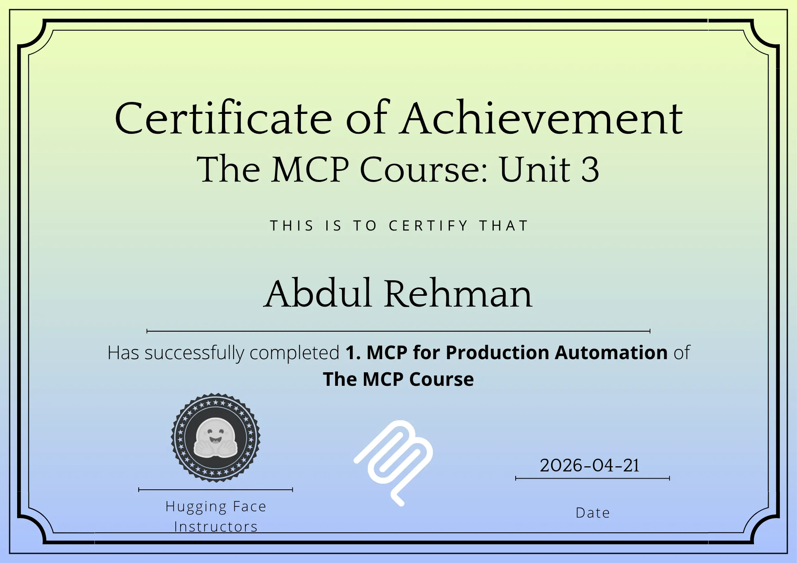

# 🚀 Unit 3 — MCP for Production Automation

<div align="center">

<p>
  
  
  
  
</p>

<p>
  
  
  
  
</p>

</div>

---

# 🎯 Overview

This folder documents my completed **Unit 3** work from the Hugging Face MCP Course.

In this unit, I built a **custom MCP workflow server for Claude Code** that automates three parts of a development workflow:

1. **PR preparation** — inspect changed files and suggest the right pull request template
2. **CI/CD monitoring** — capture GitHub Actions events locally through a webhook server and Cloudflare Tunnel
3. **team communication** — format workflow outcomes and send Slack notifications through MCP

The final result was a working **Pull Request Agent** that connected Claude Code, GitHub, Cloudflare Tunnel, and Slack in one end-to-end automation flow.

---

# 🧭 What This Unit Covers

## Module 1 — Build MCP Server
- built a FastMCP server for Claude Code
- exposed tools for:
  - `analyze_file_changes`
  - `get_pr_templates`
  - `suggest_template`
- used a safe demo Git repository to test branch analysis and template selection
- validated the implementation with tests before connecting it to Claude Code

## Module 2 — GitHub Actions Integration
- extended the server with GitHub Actions event awareness
- ran a webhook capture service locally on port `8080`
- exposed the local webhook with **Cloudflare Tunnel**
- configured GitHub webhooks and tested against a real repository/workflow
- added MCP prompts for:
  - CI result analysis
  - deployment summaries
  - PR status reports
  - workflow failure troubleshooting

## Module 3 — Slack Notification
- extended the workflow server with Slack delivery
- created a Slack incoming webhook and stored it as an environment variable
- added the `send_slack_notification` MCP tool
- formatted CI failure alerts and delivered them to a real Slack channel
- verified the full flow from GitHub/CI event to Slack message delivery

---

# 🧱 Practical Architecture Used

```text
[Git Repository / Branch Changes]
             │
             ▼
[Claude Code + PR Agent MCP Server]
   ├─ Module 1 tools → changed-file analysis + PR template selection
   ├─ Module 2 prompts → workflow summaries + troubleshooting guidance
   └─ Module 3 tool   → Slack notification delivery
             │
             ▼
[Local Webhook Server on MCP Client EC2]
             │
             ▼
[Cloudflare Tunnel]
             │
             ▼
[GitHub Webhooks / GitHub Actions]
             │
             ▼
[Stored github_events.json]
             │
             ▼
[Claude-formatted team updates]
             │
             ▼
[Slack channel notifications]
```

---

# ☁️ EC2 Practice Setup

For this unit, the **MCP client EC2** acted as the main practice machine because it hosted:

- Claude Code
- the Unit 3 `server.py` files
- the local webhook server
- Cloudflare Tunnel
- the GitHub test repository clone
- the Slack webhook environment variable

The separate **MCP server EC2** that I used earlier in Unit 2 was **not required** for the Unit 3 modules.

That made Unit 3 a more realistic workflow-server exercise centered around **Claude Code + local automation services** on one machine.

See [`ec2-practice-setup.md`](./ec2-practice-setup.md) for the condensed machine/terminal mapping.

---

# 📸 Practical Evidence

## Module 2 — Webhook Capture + Cloudflare Tunnel



The webhook server was running locally on port `8080` and storing GitHub webhook events into `github_events.json`.



Cloudflare Tunnel exposed the local webhook URL so GitHub could deliver webhook payloads over a public HTTPS endpoint.



Claude Code successfully connected to the Unit 2 workflow server registered as `pr-agent-actions`.

---

## Module 3 — Claude Code + Slack Automation



Claude Code was opened inside the GitHub repository workspace and ready to use the MCP workflow server.



Claude successfully summarized the latest workflow status using the MCP tools that read captured GitHub Actions events.



Claude then formatted the CI failure into a structured alert ready for team communication.



The `send_slack_notification` MCP tool completed successfully.



The final CI failure alert was delivered into the Slack channel, completing the end-to-end workflow.

---

# 🗂️ What Is Included In This Folder

## Documentation
- `README.md` — polished unit overview
- `unit3-notes.md` — detailed notes, lessons, and practical reflections
- `official-resources.md` — official Unit 3 pages used for this folder
- `ec2-practice-setup.md` — machine mapping and command flow summary

## Reusable Assets
- `templates/` — PR template set used by the workflow server
- `unit3-mcp-for-production-automation-certificate.jpg` — Unit 3 certificate
- `screenshots/` — renamed screenshots from the full workflow

## Implementation Files
- `implementations/module1-build-mcp-server/`
- `implementations/module2-github-actions-integration/`
- `implementations/module3-slack-notification/`

---

# 🧠 Key Takeaways

By the end of this unit, I had hands-on experience with:

- building a custom FastMCP server for Claude Code
- exposing tools and prompts for developer workflows
- collecting GitHub Actions events through a local webhook capture service
- using Cloudflare Tunnel for development-grade webhook exposure
- formatting structured workflow summaries in Claude Code
- delivering real Slack notifications through an MCP tool
- combining tools, prompts, and external systems into one practical automation flow

---

# 🏆 Certificate



---

# 📊 Status

✅ Completed  
✅ Practical workflow verified end-to-end  
✅ Full MCP Course completed

---

# 🔜 Extension Ideas

Good next upgrades for this project later:
- add more PR templates and team-specific review rules
- track more GitHub events beyond `workflow_run`
- improve Slack message formatting for deployment-success summaries
- persist webhook events in a database instead of flat JSON
- adapt the same workflow server to more repositories or teams
